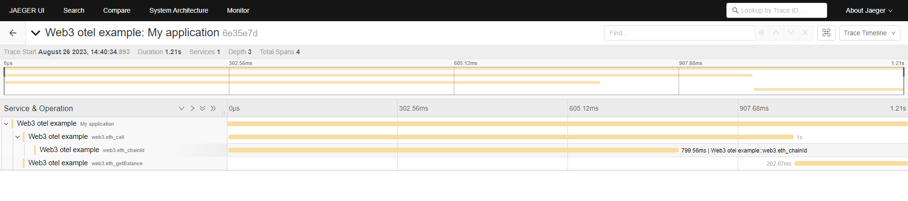

## OpenTelemetry middleware for Web3

This is a working example of how to track Web3 calls with Opentelemetry.

### Setup and run

- install and run Jaeger: `make start/jaeger` (it will download the official Docker image and run it)
- install the virtual environment: `python3.11 -m venv env`
- activate it: `. venv/bin/activate`
- install dependencies: `make setup`
- run the program: `make start`

### Open Jaeger

Open your browser to `[http://localhost:16686](http://localhost:16686/)` to see the traces in Jaeger.
You should see the traces like


## Walkthrough

### 1.  Initialize OpenTelemetry

The inizialization is done in the [middleware/otel.py](middleware/otel.py) and called from [web3_server/main.py](web3_server/__main__.py)

```python
def init_tracer() -> None:
    # setup the service name that will be visible on OpenTelemetry. Without this it will be shown as `Unknown service`
    resource = Resource.create({"service.name": "Web3 otel example"})
    
    tracer_provider = TracerProvider(resource=resource)

    set_global_textmap(TraceContextTextMapPropagator())
    
    tracer_provider.add_span_processor(BatchSpanProcessor(OTLPSpanExporter()))
    
    trace.set_tracer_provider(tracer_provider)
```
### 2. Instantiate Web3 provider and setup the middleware

Here is where you can add OpenTelemetry in the Web3 middleware stack. Check out the [documentation](https://web3py.readthedocs.io/en/stable/middleware.html#configuring-middleware) to see how it works.

In this case I am adding OpenTelemetry using the so called *middleware onion*, but you can also set it while instantiating the Web3 provider object. Though, you need to be careful with the latter, because it will [override the default](https://web3py.readthedocs.io/en/stable/middleware.html#optional-middleware) Web3 middlewares. 

```python
def get_web3() -> AsyncWeb3:
    w3 = AsyncWeb3(
        AsyncWeb3.AsyncHTTPProvider(
        # using infura here as an example to connect to Ethereum via RPC
            "https://mainnet.infura.io/v3/<your-api-key>"
        ),
        # middleware=[] <-- you can also pass custom middlewares here, but this will override the default ones. Be careful.
    )
    
    # Add the OpenTelemetry middleware to the middleware stack
    w3.middleware_onion.add(otel_web3_middleware)

    async def _async_simple_cache(make_request, async_w3):
        middleware = await async_construct_simple_cache_middleware(
            rpc_whitelist={RPCEndpoint("eth_chainId")},
        )
        return await middleware(make_request, async_w3)

    # Add the cache middleware to the middleware stack
    # This avoids making the request to get the chain_id every time
    w3.middleware_onion.add(_async_simple_cache, name="Cache chain_id")
```
Web3 middleware allows you to cache certain things, such as useless calls. In this example I am caching the calls to `eth_chainId`, which is [automatically called everytime](https://github.com/ethers-io/ethers.js/issues/901) you make a call to `eth_call`.